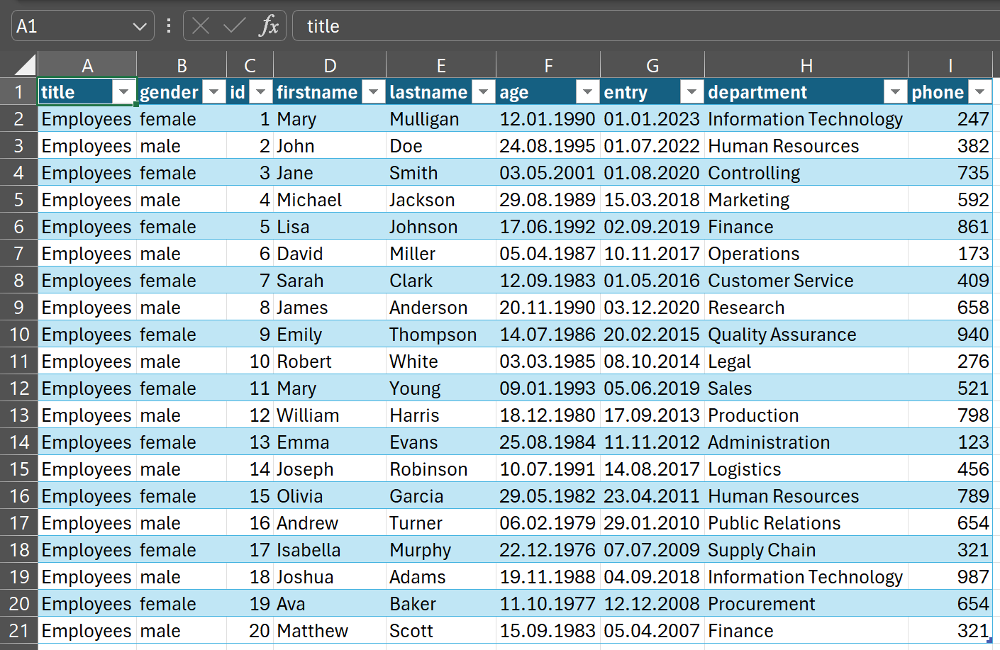

# XML-Data-Processing
> structured transfer and storage of data

## What is XML?
XML stands for "Extensible Markup Language" and is a markup language used for representing and structuring data. Unlike HTML, which focuses on presenting content in web pages, XML is designed to describe and transport data.

## Uses of XML
XML is used in a variety of applications, including:

Data Transmission: XML is often used to exchange data between different systems and platforms. It provides a structured and interoperable way to transmit data.

Configuration Files: Many applications use XML-based configuration files to store settings and options.

Databases: XML is sometimes used to store data in databases, especially in NoSQL databases that allow flexible data structures.

Document Processing: XML is used in document processing to describe the structure of text documents, presentations, spreadsheets, and other types of documents.

## Reading and Displaying XML
There are various ways to read and display XML data:

Text Editor: XML files can be opened and viewed in a simple text editor such as Notepad++ or Visual Studio Code. These editors often provide syntax highlighting and structural views for better readability.

Web Browser: Some web browsers can directly display XML files. When you open an XML file in a browser, it is often displayed in a structured tree view.

XML Parser: In programming languages such as Python, Java, or JavaScript, XML parsers can be used to read XML data and convert it into custom formats. These enable the processing of XML data in applications.

## Exporting and Importing XML
Exporting and importing XML data depends heavily on the application and context. Here are some common scenarios:

Exporting Data: In many applications, data can be exported to XML to share it with other systems or applications. This can be done through special export functions or by converting internal data structures into XML.

Importing Data: To import XML data, it needs to be converted into the application's internal format. This can be achieved through special import functions or by parsing the XML data with an XML parser.

Database Integration: In some cases, XML data can be directly imported into databases, either as XML data types or after conversion into relational data structures.

## Using XSL with XML
XSL (Extensible Stylesheet Language) is often used in conjunction with XML to transform and present XML data. XSL allows you to define stylesheets that specify how XML data should be displayed or transformed into other formats, such as HTML.

### Import in Excel:

